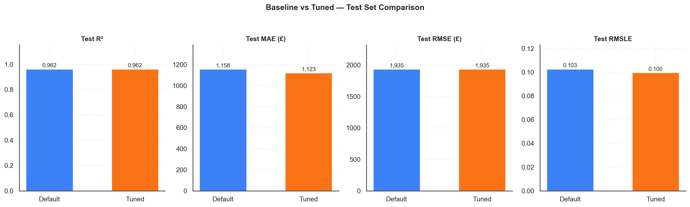
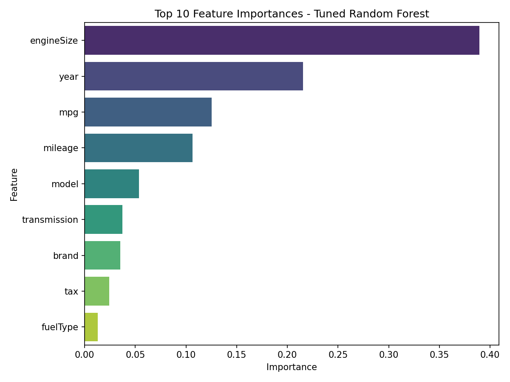
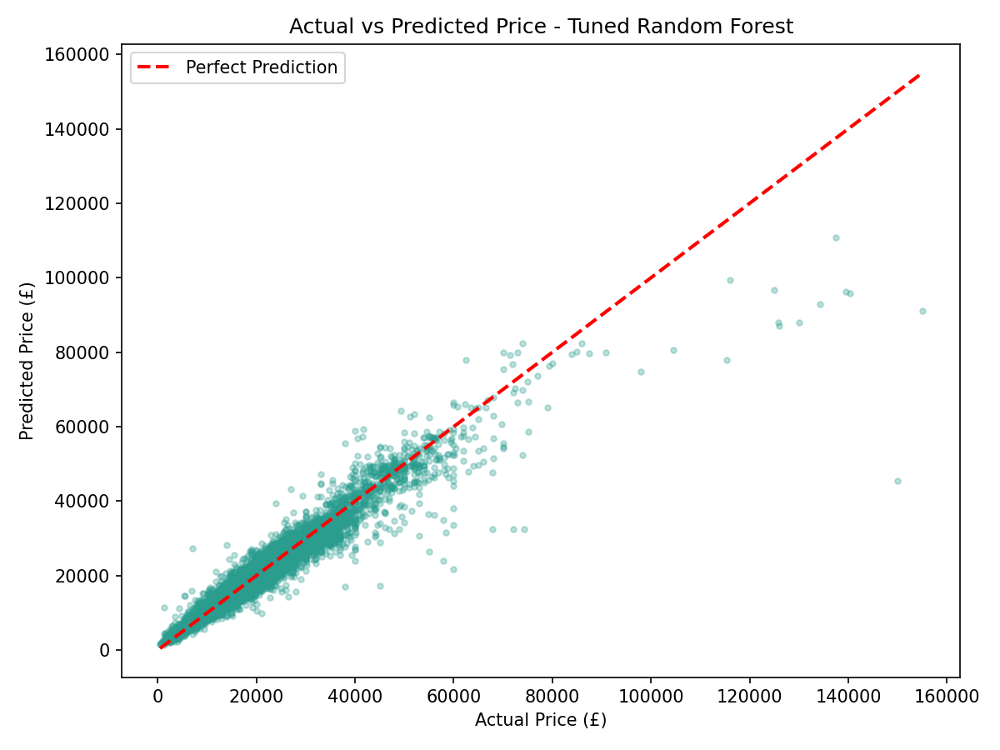
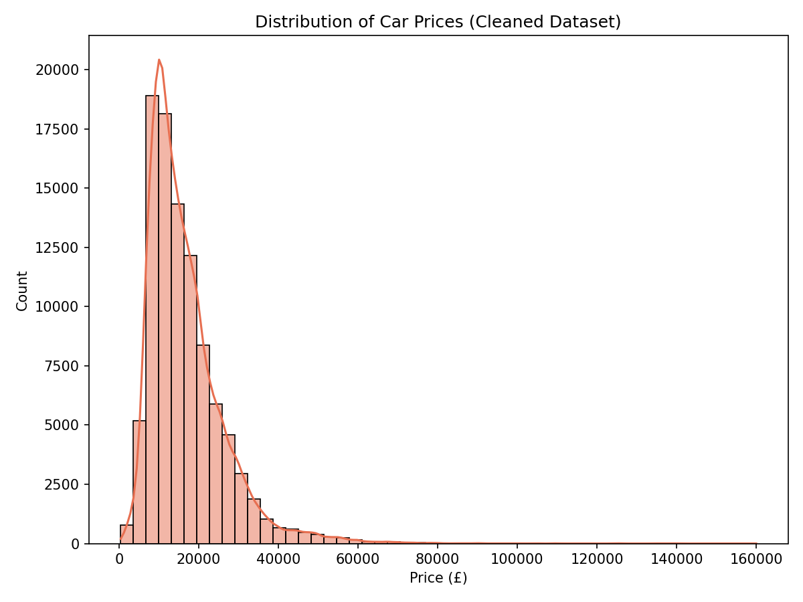

# 🚗 Automobile Price Prediction


An end-to-end machine learning project that predicts the resale price of used cars from 9 major brands using a Random Forest Regressor, with full EDA, outlier treatment, feature engineering, hyperparameter tuning and model evaluation.

## Problem Statement

Used-car pricing is inconsistent across brands, models and sellers. This project builds a regression model that estimates a fair market price for a used car from its brand, model, age, mileage, fuel type, engine size, road tax and fuel economy (mpg) — the kind of tool a dealership or resale marketplace could use to flag under/over-priced listings.

## Dataset

- **Source:** [100,000 UK Used Car Data Set – Kaggle](https://www.kaggle.com/datasets/adityadesai13/used-car-dataset-ford-and-mercedes)
- **Brands:** Audi, BMW, Ford, Hyundai, Mercedes, Skoda, Toyota, Vauxhall, VW (9 separate CSVs, combined)
- **Size:** 99,187 raw listings → **97,413 rows** after cleaning (invalid years, duplicates, mpg/engine-size outliers removed) × 10 columns
- **Target:** `price` (£)
- **Features:** `brand`, `model`, `year`, `transmission`, `mileage`, `fuelType`, `tax`, `mpg`, `engineSize`

## Workflow

1. Data Loading — 9 brand CSVs read and tagged with a `brand` column
2. Data Cleaning — schema standardization, invalid years/duplicates removed
3. Exploratory Data Analysis — brand mix, price and mpg distributions
4. Outlier Treatment — IQR-based mpg cleanup, invalid `engineSize == 0` rows dropped
5. Feature Engineering — label encoding of categorical columns
6. Train/Test Split — 80/20
7. Model Building — Random Forest Regressor (default) as baseline
8. Hyperparameter Tuning — `RandomizedSearchCV` (5-fold CV, RMSLE-based scorer)
9. Model Evaluation — R², MAE, RMSE, RMSLE + feature importance
10. Conclusion — findings, limitations, next steps

## Key Results

| Model | Test R² | Test MAE (£) | Test RMSE (£) | Test RMSLE |
|---|---|---|---|---|
| Random Forest — Default Parameters | 0.9621 | 1,157.95 | 1,934.93 | 0.1027 |
| Random Forest — Tuned (RandomizedSearchCV) | 0.9621 | **1,122.51** | 1,935.36 | **0.0996** |

The two models are essentially **tied on R² and RMSE**, while tuning gives a small, real edge on MAE and RMSLE (~3% lower each) and — more importantly — a smaller train/test R² gap (0.021 vs. 0.032), meaning the tuned model generalizes slightly better. See the notebook's Conclusion section for the full explanation and business insights (top price drivers, limitations, next steps).

*(Both models are now seeded with `random_state=42` for reproducibility — earlier runs without a fixed seed varied noticeably between re-runs.)*

### Model Performance Comparison


### Top 10 Feature Importances


### Actual vs Predicted Price


### Price Distribution


## Tech Stack

Python · pandas · NumPy · scikit-learn · Matplotlib · Seaborn · Plotly · Jupyter

## How to Run

```bash
git clone https://github.com/Dt-Ansari07/Automobile-Price-Prediction-Analysis.git
cd Automobile-Price-Prediction-Analysis
pip install -r requirements.txt
jupyter notebook notebooks/automobile_price_prediction.ipynb
```

Data files are already included in `data/` (~5 MB total), so the notebook runs end-to-end with no extra downloads.

## Project Structure

```
Automobile-Price-Prediction-Analysis/
├── data/                              # 9 brand-wise CSVs (audi, bmw, ford, hyundi, merc, skoda, toyota, vauxhall, vw)
├── notebooks/
│   └── automobile_price_prediction.ipynb
├── src/
│   ├── evaluation.py                  # reusable model-evaluation helper
│   └── plotting.py                    # shared chart style + plotting functions
├── images/                            # exported charts used in this README
├── requirements.txt
├── .gitignore
├── LICENSE
└── README.md
```

## Author

**Zulfiqar Ansari**
[LinkedIn](https://linkedin.com/in/zulfiqar-ansari) · [Portfolio](https://dt-ansari07.github.io/portfolio-v2/)
